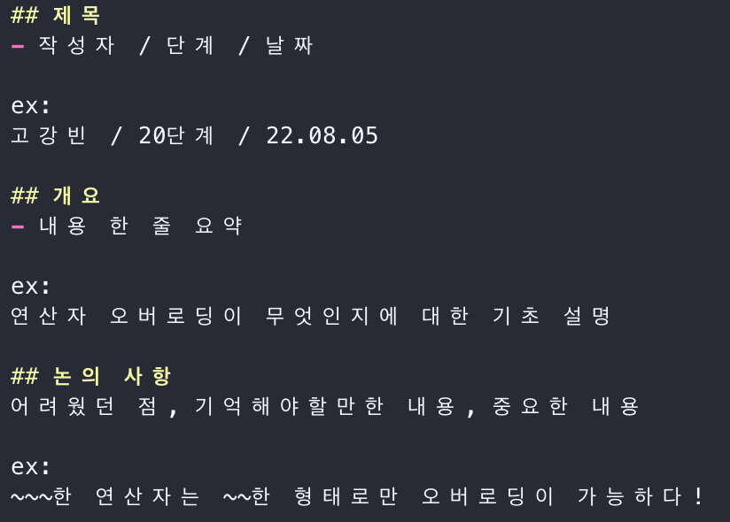

# DeepLearning-from-Scratch-3-Study_2022-Summer

  <a href="http://www.yes24.com/Product/Goods/95343845">
  <h1>밑바닥부터 시작하는 딥러닝 3</h1></a>
  <h3>파이썬으로 직접 구현하며 배우는 딥러닝 프레임워크</h3>
  
사이토 고키 저

  
한빛미디어

 

2022년 여름방학에 진행하는 '밑바닥부터 시작하는 딥러닝 3' 완독 스터디 
기본적으로 GIST 소그룹 스터디이지만, 원하시는 누구나 함께 하실 수 있으며 피드백도 환영합니다. 

---

## 📚 스터디 일정 및 커리큘럼

(추후 논의 후 작성 예정)

---

## ✅ 참여 방법

1. 이 저장소를 fork 한다. ~저장소 star를 누른다~
2. 생성된 원격 저장소에 이름 혹은 github ID로 폴더를 생성한다.
3. 생성된 폴더에 자신의 소스코드를 업로드 한다.
4. 이때 commit 규칙 및 PR 규칙을 잘 지키도록 한다!
5. 원본 저장소로 Pull Request를 한다. (주기적으로 Merge 예정)
6. 다른 사람들의 PR을 보고 스터디 전까지 리뷰를 남긴다.

⚠️ 주의!! 기존 폴더를 지우거나 수정 금지! 메인 디렉토리에 추가 금지! 개인 폴더 내부만 수정해주세요 :)

---

## ✅ Commit 규칙

### 1. Commit Type 설정
  - feat: 새로운 코드 추가
  - fix: 기존 코드의 에러 수정
  - docs: 문서 작성
  - style: 코드 실행에 영향을 미치지 않는 코드 수정 (ex: 공백 수정)
  - refactor: 코드 리팩토링
  - perf: 코드의 퍼포먼스를 업그레이드 하는 수정 사항
  - test: 테스팅을 위한 파일 추가
  - build: 시스템이나 외부 의존성 라이브러리 구축
  - ci: 설정 변경

### 2. Scope 설정
어떤 부분에 대한 커밋인지 명시 (생략 가능)

### 3. Short summary
해당 커밋에 대한 간단한 설명 
영어로 작성 시 모두 소문자로 작성할 것

ex: 
perf(DeZero): 속도 최적화

----

## ✅ PR 규칙

 

\* PR 생성 시 자동 적용

----

## ❇️ (option) 리뷰 규칙

- PR에서 코드리뷰를 한다.
- 전체 코드 및 내용 흐름을 이해 후 의견 제시
  - 잘했다고 생각하는 부분
  - 이렇게 하면 더 좋을 것 같다고 생각하는 부분
  - 궁금한 부분
  - 기타 의견

----

## ⭐️ 참여자
<table>
  <tr>
    <td align="center">
      <a href="https://github.com/KevinTheRainmaker">
        
          <h3>Kangbeen Ko</h3>
          <h5>GIST EECS 19th</h5>
        </a>
      </td>
    <td align="center">
      <a href="https://github.com/dwjustin">
        
          <h3>Dongwoo Kim</h3>
          <h5>GIST EECS 20th</h5>
        </a>
      </td>
    <td align="center">
      <a href="https://github.com/willystumblr">
        
          <h3>Minseo Kim</h3>
          <h5>GIST EECS 20th</h5>
        </a>
      </td>
    <td align="center">
      <a href="https://github.com/Reelect">
        
          <h3>Jaesun Lee</h3>
          <h5>GIST EECS 19th</h5>
        </a>
      </td>
  </tr>
</table>

 
